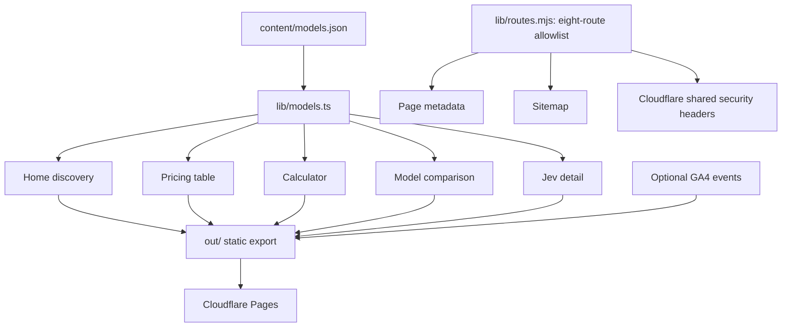

# ARCHITECTURE.md - ToolPilot

## Current Architecture

ToolPilot is a static Next.js App Router site. It has no runtime API, database, CMS, authentication, or user-submitted data. The build exports HTML to `out/` for Cloudflare Pages.

```mermaid
flowchart TD
    M[content/models.json] --> L[lib/models.ts]
    L --> H[Home discovery]
    L --> P[Pricing table]
    L --> C[Calculator]
    L --> X[Model comparison]
    L --> J[Jev detail]
    R[lib/routes.mjs: eight-route allowlist] --> MD[Page metadata]
    R --> SM[Sitemap]
    R --> AH[Cloudflare shared security headers]
    H --> O[out/ static export]
    P --> O
    C --> O
    X --> O
    J --> O
    O --> CF[Cloudflare Pages]
    GA[Optional GA4 events] --> O
```

## Route and Indexing Boundary

`lib/routes.mjs` is the explicit list of eight public content routes. `app/sitemap.ts`, per-page metadata, `scripts/check-artifacts.mjs`, and `scripts/smoke.mjs` enforce the same allowlist. There is no dynamic model route or `/models/` index. Only `app/models/jev/page.tsx` is a model detail page. Other model records are used in discovery, pricing, calculator, and comparison UI.

Unknown and retired routes use the static 404 response. Two exact Pages Functions return a noindex 404 for `/404` and `/404.html`, preventing Cloudflare Pages from serving its own error document as a 200 URL. No broad redirects are configured. HTTP smoke checks cover these aliases and removed product paths.

## Model Data and Pricing

- `content/models.json` is the single public source for all model facts and token rates.
- `lib/models.ts` exposes model lookup and date-valid schedule selection without creating routes.
- `lib/model-cost.ts` computes request, daily, monthly, and annual estimates from the selected model record.
- `components/model-tools.tsx` implements search, pricing filters/sort, calculators, and up-to-three-model comparison. Pricing lists every schedule; Calculator and Compare allow a schedule to be selected per model and identify the rates used.
- `components/ad-slot.tsx` exposes the four approved future ad placements and returns no markup until content is supplied.
- Every record has one or more official source URLs and `lastVerifiedAt`; an API model ID may be null until the provider publishes one. `scripts/check-models.mjs` checks source host allowlists, record structure, and the single Jev detail route.
- Rate schedules may retain `priceType`, `validFrom`, `validUntil`, a `nextPricing` schedule reference (whose date may be null until announced), `pricingSchedule` window metadata, and `pricingNotes`, alongside long-context thresholds, cached input, and additional rates. Calculator estimates use the selected/default schedule and disclose its validity or time window and excluded fees. Non-applicable output billing uses `not_applicable` and contributes no output-token charge; it is never represented as a numeric zero rate.

Client components are statically rendered by Next.js and hydrate for filtering and calculation. Calculator inputs remain in browser state and are not submitted to ToolPilot.

## SEO and Static Artifacts

Every page has unique title, description, self canonical, robots directive, Open Graph title/description/URL, and Twitter card metadata. Homepage structured data uses `WebSite` and `WebApplication`; nested routes include visible breadcrumbs with `BreadcrumbList`. There is no FAQ structured data.

GSC verification metadata and GA4 are build-time optional. Analytics events use a fixed payload allowlist, strip query strings from page locations, and never include calculator counts or raw search text. With the measurement ID unset, no Google Analytics script is emitted.

The sitemap is generated from the route allowlist and must have exactly eight entries. `robots.txt` allows crawling, including `/models/jev/`, and references the sitemap. Static export includes the eight content route documents and a noindex 404 document.

`npm run build` injects a document-specific CSP meta generated from static HTML scripts and writes `out/_headers` with the shared response policy. Static artifact checks verify CSP, metadata, canonical, sitemap, robots, source links, local links, and route count.

## Hosting and Operations

Cloudflare Pages Git Integration project `toolpilot-git` currently serves `toolpilot.cc`; project `toolpilot` is retained as a recovery target. The application has no secrets or runtime external fetches. CI runs lint, typecheck, tests, static build, and local HTTP smoke. Production smoke is read-only and does not deploy.

Current verification and release evidence belongs in `TASK.md` and `RUNBOOK.md`. No build artifact or historical deployment report should be treated as current without checking the present checkout and live target.
