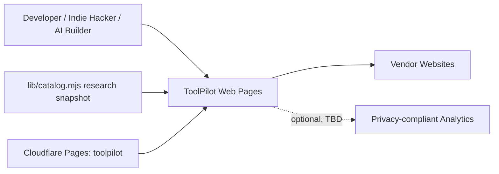
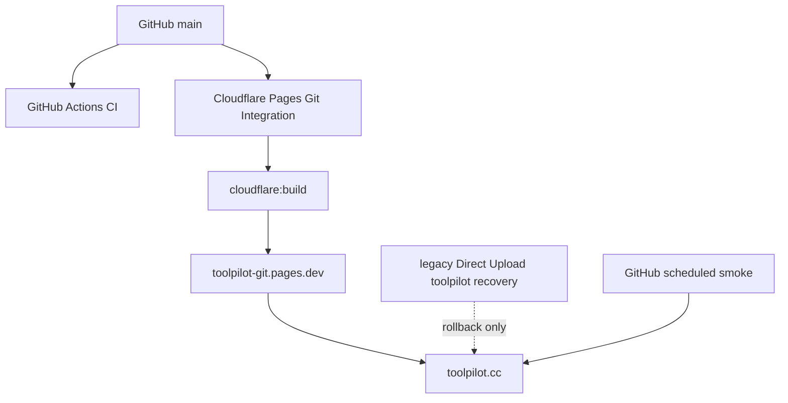

# ARCHITECTURE.md - ToolPilot

## 文档信息

- 状态：`MVP IMPLEMENTED / ADR PENDING`
- Owner：`TBD`
- 最后更新：`2026-09-27`
- 相关 ADR：`DECISIONS.md`、`docs/adr/0001-static-export-mvp.md`、`docs/adr/0008-cloudflare-pages-git-integration.md`
- 证据边界：当前架构事实来自源码、`package.json`、`next.config.mjs`、`npm run build`、`out/`、Cloudflare Pages GitHub check 和公网 smoke；CNAME 切换后的 `toolpilot.cc` 已通过 `SMOKE_PROFILE=current`。

## TASK-005 当前架构（2026-09-27）

- 内容流：content/tools 与 content/decisions JSON → lib/content.mjs 校验/读取 → 服务端模板 → out/。
- 历史流：lib/catalog.mjs 的 researchTools 原样保留；tools 提供兼容叠加视图。新增产品无伪造旧检查日期。
- 审核与安全边界：lib/content-policy.mjs 校验来源、修订/digest、依赖、商业关系；客户端只收到 publicTool allowlist DTO。
- 路由：lib/routes.mjs 是页面与索引清单，metadata.ts、sitemap、smoke、产物检查共用。site-config 仅管理站点 URL。
- 商业：Affiliate、Featured、Sponsor 分别记录；只有有效审核和关系证据才能激活商业目的地，未知关系不冒充合作。
- 维护：独立 HTTPS 域名 allowlist、DNS 全结果公网校验、固定已验证地址连接、3 次重定向限制；不引入任意运行时抓取服务。
- 本地构建覆盖 88 个站内 HTML 路径；Next 日志另计 404/元数据路由，不能混淆计数。没有内容正式审批时 sitemap 为 4 个站点说明入口。
- 数据和公开接口迁移、批准失效及回滚见 ADR-0009。仍无数据库、API、CMS、账户或分析。

下方既有 MVP 章节保留历史背景；2026-08 构建/部署数字与尚未实现描述不能覆盖上述当前代码边界。生产是否更新仅以部署和公网证据为准。

## 1. 架构目标

- 业务能力：面向开发任务的工具发现、比较、替代方案和技术栈决策页面。
- 质量属性优先级：`内容可信度 > 安全与隐私 > 可抓取性 > 可靠性 > 性能 > 成本`。
- 规模假设：`TBD`；当前没有用户、RPS、数据量或流量基线。
- 主要约束：MVP 使用静态输出；外部工具资料和厂商提交必须经过验证；商业曝光不得影响独立评价。

已验证事实：`next.config.mjs` 配置 `output: "export"`、`trailingSlash: true`；Node 22 下 `npm run build` 生成 66 个静态页面/元数据路由到 `out/`，其中包含 50 个工具详情页。

## 2. 系统上下文

```mermaid
flowchart LR
    U[Developer / Indie Hacker / AI Builder] --> W[ToolPilot Web Pages]
    W --> V[Vendor Websites]
    W -. optional, TBD .-> A[Privacy-compliant Analytics]
    C[lib/catalog.mjs research snapshot] --> W
    S[Cloudflare Pages: toolpilot] --> W
```

- 当前 Web 形态是 Next 静态导出；源码和构建产物均可复核。
- 厂商站点是出站依赖；Affiliate、Featured 和 Sponsor 的关系必须在页面上披露。
- 内容源当前是 `lib/catalog.mjs` 的 50 条研究草稿数据；静态托管为 Cloudflare Pages，生产域名为 `toolpilot.cc`；分析平台和管理入口均未配置。
- 交付控制面由 GitHub `.github/workflows/ci.yml`、`.github/workflows/production-monitor.yml` 和 Cloudflare Pages Git Integration 构成；GitHub Actions 负责质量和 current 生产 smoke，Cloudflare 从 `main` 构建/部署 `toolpilot-git`，该项目已承载 `toolpilot.cc`。

## 3. 组件与责任

| 组件 | 路径/服务 | 责任 | 数据所有权 | 上游/下游 | Owner |
| --- | --- | --- | --- | --- | --- |
| Web 页面 | `app/`、`components/` | 首页、工具、指南、法律和决策页 | ToolPilot 草稿内容 | Next 配置、目录数据、Cloudflare Pages | `TBD` |
| 内容模型 | `lib/catalog.mjs` | 50 条分类、草稿工具、`productUrl`、`sourceUrl`、链接检查、来源状态、编辑审核和正式核验字段、决策页和指南 | ToolPilot 草稿 | 编辑、公开来源 | `TBD` |
| 站点配置 | `lib/site-config.mjs` | 默认站点 URL、静态路由和构建时 URL 归一化，供 robots/sitemap 使用 | 无业务数据 | 构建环境、Next 元数据路由 | `TBD` |
| 构建输出 | `.next/`、`out/` | Next 中间产物和最终静态 HTML/CSS/JS | 不拥有业务数据 | `npm run build` -> Cloudflare Pages | `TBD` |
| 出站链接 | 页面中的产品官网/研究来源 URL | 将用户带到工具厂商或研究来源，并区分官网、来源和研究商业状态 | 第三方厂商/公开来源 | ToolPilot -> 外部站点 | `TBD` |
| 分析 | 服务 `TBD` | 记录最小化的决策页浏览和出站点击 | `TBD` | 浏览器 -> 分析服务 | `TBD` |
| CI/运维控制面 | `.github/workflows/`、`scripts/smoke.mjs`、`scripts/release-readiness.mjs`、Cloudflare Pages Git Integration | 质量门槛、仓库状态检查、生产可用性检查、Git 提交触发 Pages 构建 | 不拥有业务数据；CI/Smoke 只消费 Git 元数据、构建产物和公开 HTTP 响应；正常 Pages 构建不需要仓库 Secret | GitHub -> CI/Cloudflare Pages -> `toolpilot.cc` | `TBD` |

当前未实现独立 API、数据库、CMS、认证服务、后台或任务队列。

## 4. 关键数据流

### 4.1 内容发布流（目标设计，未实现）

1. 编辑或厂商提交工具事实、来源和商业关系。
2. 系统校验 URL、字段和外部输入，编辑审核内容。
3. 构建生成工具详情、决策页、站点地图和法律页面。
4. 发布前检查来源、更新时间、商业披露、链接和页面主题。

- 信任边界：提交者/外部来源 -> 审核系统 -> 公开静态页面。
- 一致性要求：页面事实、来源、更新时间、链接检查、编辑审核和商业标记必须同一版本可追溯。
- 失败处理：链接检查失败或来源缺失显示待核实；`reviewStatus=pending-editorial` 或 `verifiedAt=null` 的条目不能作为正式事实发布，不使用默认编造值。
- 幂等/重试：构建和发布策略 `TBD`；内容版本应使用稳定 ID 或 slug。

### 4.2 用户出站流（目标设计，未实现）

1. 用户打开 ToolPilot 决策页。
2. 用户查看工具事实、比较维度、限制和商业关系。
3. 用户点击厂商链接；必要时记录最小化出站事件。
4. 用户在厂商站点完成后续注册或购买；转化归因由合作方报告确认。

- 信任边界：ToolPilot 公开页面 -> 第三方厂商站点。
- 一致性要求：页面必须区分 Affiliate、Featured/Sponsor 和普通链接。
- 失败处理：失效链接标记并进入内容复核，不把跳转成功伪装为转化成功。
- 幂等/重试：分析事件方案 `TBD`；不得因重试重复计算业务成交。

## 5. 接口与事件

| 接口/事件 | Producer | Consumer | 契约位置 | 兼容策略 | SLO |
| --- | --- | --- | --- | --- | --- |
| 静态页面路由 | Next build | 浏览器/搜索爬虫 | `app/` 路由；构建输出位于 `out/` | 保持稳定 URL，变更需重定向/迁移方案 | `TBD` |
| `sitemap.xml` | `app/sitemap.ts` | 搜索爬虫 | `out/sitemap.xml`；站点 URL 来自 `NEXT_PUBLIC_SITE_URL` 或默认值 | 只发布真实可用 URL | `TBD` |
| `robots.txt` | `app/robots.ts` | 搜索爬虫 | `out/robots.txt`；与 sitemap 同源 | 与站点地图和域名保持一致 | `TBD` |
| `vendor_outbound_click` | 浏览器页面 | 分析平台 `TBD` | 事件契约 `TBD` | 版本化属性，避免敏感数据 | `TBD` |
| Affiliate/赞助链接 | ToolPilot 页面 | 厂商站点/合作方 | 合作方条款 `TBD` | 页面显式披露，关系变更需审计 | `TBD` |

## 6. 数据架构

| 数据域 | 存储 | 主键/分区 | 保留策略 | 备份/恢复 | 敏感级别 |
| --- | --- | --- | --- | --- | --- |
| 工具公开事实 | `lib/catalog.mjs` 草稿数据 | 工具 slug | 当前随代码版本发布；正式复核策略由 ADR-006 约束 | Git/构建产物备份 `TBD` | Public / 可能含 Internal 编辑字段 |
| 来源与编辑记录 | `TBD` | 工具 ID + 版本/时间 `TBD` | `TBD` | `TBD` | Internal |
| 厂商提交 | `TBD` | 提交 ID `TBD` | `TBD` | `TBD` | Internal，可能含个人或商务信息 |
| 分析事件 | `TBD` | 事件 ID/时间 `TBD` | 最小化保留，期限 `TBD` | `TBD` | Internal / Confidential |
| 密钥与令牌 | 受控密钥存储 `TBD` | 不进入应用数据 | 最短必要期限 | 轮换/吊销 `TBD` | Restricted |

数据库迁移规则：当前没有数据库和迁移文件；确认引入数据层后，必须增加可向前部署的迁移、回滚/前滚说明和备份恢复验证。

## 7. 非功能设计

### 可靠性

- SLO/SLA：`TBD`；仓库已配置每 15 分钟生产 smoke 和手动触发入口，Git Integration 构建已验证；通知路由和 Cloudflare 内部指标仍未确认。
- 降级策略：静态页面优先；分析不可用不应阻塞页面访问；厂商链接失败应进入内容复核。
- 灾难恢复：RPO `TBD` / RTO `TBD`；需确认静态产物、内容源和部署平台的备份方式。

### 性能与容量

- 延迟目标：`TBD`；静态输出和缓存是观察到的方向，不是性能承诺。
- 峰值负载：`TBD`。
- 扩容方式：由 Cloudflare Pages 边缘静态托管提供；当前没有应用服务端、数据库或 `.wrangler` 项目配置。

### 安全

- 认证授权：当前没有已观察的用户或管理认证；若加入后台，必须单独设计身份、最小权限和审计。
- 密钥：只允许环境/受控密钥存储，禁止进入源码、`.next`、日志和文档。
- 加密：生产传输应使用 HTTPS；静态存储、分析和第三方服务加密策略 `TBD`。
- 审计：内容来源、更新时间、商业标记和管理员动作应可追溯；实现 `TBD`。

### 可观测性

- 日志：当前没有应用日志配置；禁止记录原始个人数据、令牌和厂商敏感信息。
- 指标：仓库 smoke 覆盖页面可用性、审核标记和 sitemap 完整性；构建成功、链接有效性、内容新鲜度和出站点击仍需独立指标。
- Trace：`TBD`；静态站点当前没有服务端 Trace 证据。
- 告警：生产 smoke 失败会使 GitHub Actions workflow 失败；邮件/聊天/PagerDuty 等通知路由为 `TBD`，内容过期和链接失效不由该 smoke 自动判定。

## 8. 部署拓扑

```mermaid
flowchart TD
    R[GitHub main] --> CI[GitHub Actions CI]
    R --> CF[Cloudflare Pages Git Integration]
    CF --> B[cloudflare:build]
    B --> H[toolpilot-git.pages.dev]
    H --> D[toolpilot.cc]
    L[legacy Direct Upload toolpilot recovery] -. rollback only .-> D
    M[GitHub scheduled smoke] --> D
```

Cloudflare Pages Git Integration 已连接 `yubinhong/toolpilot` 的 `main`，成功运行 `npm run cloudflare:build` 并向 `toolpilot-git.pages.dev` 发布；用户已将 `toolpilot.cc` CNAME 切换至新项目，commit `4fb09bca` 部署至 Pages deployment `76a9ace8-375f-40fd-b31a-acdb22661512`。该 immutable preview 和正式域名 current smoke 均覆盖 88 个页面、robots、sitemap 和真实 404 并通过；production-monitor current-profile run `36299788937` 也通过。旧 Direct Upload 项目保留作恢复目标。

## 9. 架构边界与禁止模式

- 不把 `.next`、缓存或 `.wrangler` 状态目录当作源码、内容数据库或部署配置。
- 不让厂商提交直接成为独立评价，不允许付费修改事实、比较结论或自然排序。
- 不在没有数据模型、权限、迁移、备份和删除策略前引入用户账户、CMS、支付或分析存储。
- 旧 Crypto/DeFi 生成内容已按用户确认不迁移；不从构建缓存或外部生成物恢复未经审核的页面。
- Affiliate、Featured 和 Sponsor 必须在页面、链接和分析中分开处理并清楚披露。

## 10. 技术债与演进

| 项目 | 当前影响 | 触发改造的阈值 | 目标方向 | 跟踪 |
| --- | --- | --- | --- | --- |
| 研究草稿尚未完成正式来源和审核版本 | 不能发布可信工具事实 | 产品/内容 Owner 完成 50 条内容核验和审核清单 | 可追溯的内容版本/审核流程 | `TODO-005`、`TODO-006`、`ADR-006` |
| Node 22 要求与 Node 20 shell 不一致 | 直接运行命令可能结果不同 | 固定 CI/本地 Node 22 | 统一运行时和工具链 | `TODO-002` |
| 无数据层和内容版本方案 | 无法维护来源和审核状态 | 内容规模或多人编辑需求出现 | 选择静态数据、CMS 或数据库 | `TODO-006` |
| GitHub 通知和生产回滚演练未完成 | 仓库质量检查、current smoke 和 Git Integration 已运行 | Owner 配置通知、分支保护并确认生产回滚窗口 | 启用告警通知、部署审计和回滚演练 | `TODO-004`、`TODO-302`、`ADR-007` |
