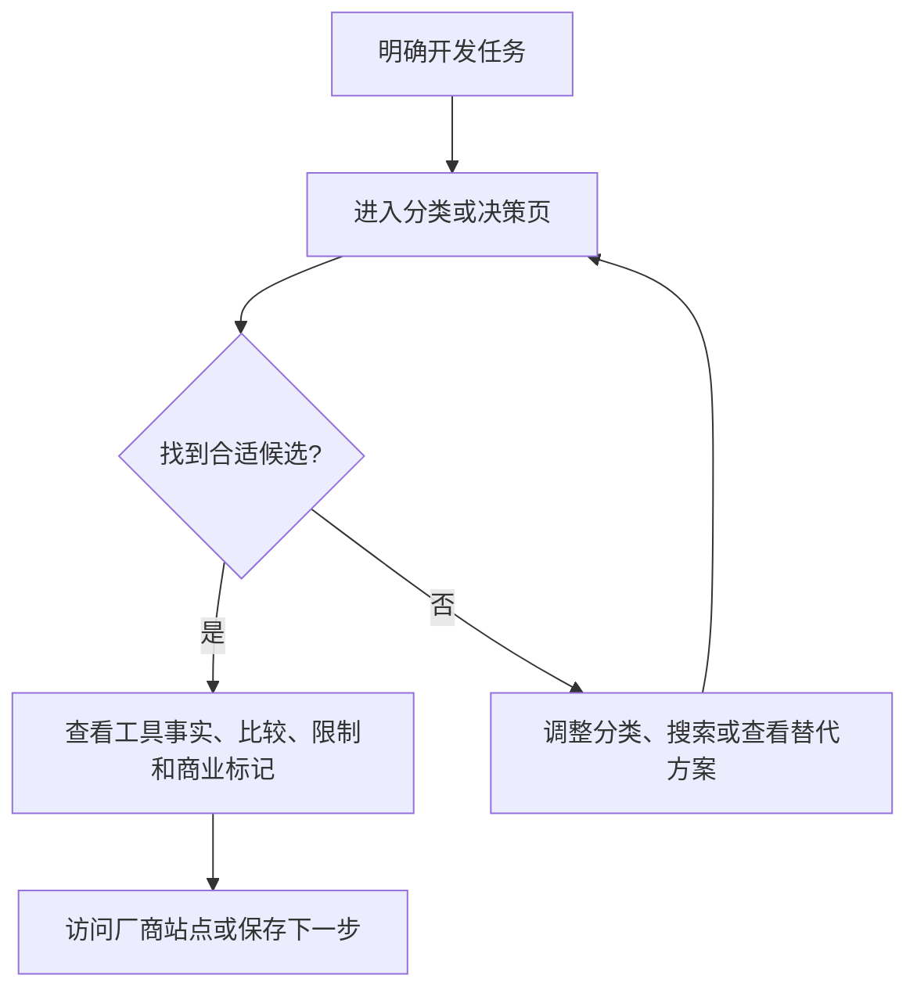

# PRD-001 - ToolPilot 开发者工具发现与决策平台

## 文档信息

- PRD ID：`PRD-001`
- 状态：`DRAFT`
- Owner：`TBD`
- 技术负责人：`TBD`
- 创建/更新：`2026-09-27`
- 关联任务：`TASK-002`、`TASK-003`；当前实现包含 50 条研究快照并已发布静态草稿，不代表 PRD 已批准正式内容范围

## TASK-005 已批准整改范围（2026-09-27）

用户已批准工程实施：英文 AI Coding / AI App Builders；保留 Next 静态导出；旧草稿保留 URL 并 noindex；用户最终批准每份内容。该授权不代表下方历史 PRD 中的厂商提交、商业化或其他候选功能获准实施。

- 52 个工具身份包含原 50 条历史快照和 Claude Code/Cline；首批 28 条结构化内容：8 工具、6 比较、6 替代、4 价格、2 场景、2 指南。
- 页面有适用/不适用、条件化结论、来源、日期、价格口径和迁移说明；未知与不支持分开，无实测不写测试日期。
- 正式内容必须有用户审核身份、时间、修订号、摘要和实际批准记录；依赖事实变更需要重审。
- 页面 URL 不变；新增 compare/alternatives/pricing/best 详情。sitemap 与 canonical 共用路由清单；草稿不索引，未知 URL 404。
- 商业研究与实际合作关系分开；公开 DTO 不包含内部佣金。无确认不激活联盟链接、广告或分析。
- 联系/主体/最终法律说明待用户提供；正式内容与生产发布分别验收。
- 本次研究不具备原始 GSC、PV 或转化数据；指标是假设，不是产品承诺。

## TASK-006 实施决策（2026-09-27）

- 按重建计划 P0.4 提供浅色和深色主题：初始跟随系统偏好，用户可在页头手动选择；显式选择仅保存在当前浏览器，不上传、不用于分析。
- 主题必须覆盖文本、页面/卡片表面、输入控件、提示框、焦点和选中状态，并在移动与桌面视口可用；核心文本和控件状态满足至少 4.5:1 对比度。
- 页面分享预览使用统一的自有通用 1200x630 图；不得放入未经许可的厂商标志、未经核验的排名/指标或比较结论。所有注册路由的 Open Graph 和 Twitter large-image 标签由静态产物检查覆盖。
- 首页提供 AI Coding、AI App Builders 和 Automation & Agents 分类入口，并展示带实际审核状态的比较研究与定价记录更新时间。只有已发布且有 `verifiedAt` 的工具档案才进入“Recently Verified”；无记录时显示空状态。“Popular”比较必须等到有可复核的真实使用信号及获批的数据/隐私依据，不从目录快照推断。按重建计划 §49，MCP 和 self-hosted 已有全站导航入口及 noindex 证据综述；§43/§44/§51 的深层目录与筛选仍属 P2，内容发布和维护责任待 TODO-310 与精确 revision/digest 审核。
- P0.7 继续使用既有 `/editorial-policy/` 与 `/disclosure/` canonical 路径，用户可见名称分别为 Methodology 和 Affiliate Disclosure，不创建重复索引路由。方法说明按字段来源呈现价格/功能核验、实测门槛、条件化选择标准和 freshness review 阈值；阈值不是发布承诺。披露页必须按当前代码状态说明 Affiliate、Featured、Sponsor 均未激活，并保持普通链接与各商业关系可见区分。真实运营主体、联系渠道和最终法律文案仍待 Owner 提供。

历史基线与已发布记录见归档 TASK-004；以下 2026-08 需求保留作背景，当前实现状态以 TASK-005 和 ADR-0009 为准。

## 1. 摘要

ToolPilot 面向 Developer、Indie Hacker 和 AI Builder，帮助用户围绕一个具体开发任务发现工具、比较候选方案、查看替代品并组合技术栈。首个垂直领域是开发者工具，优先建设 `Best`、`Compare`、`Alternatives`、`Stacks` 和实用指南页面。

本 PRD 是研究后的产品草案，不代表功能已经实现。`TASK-002` 已建立 50 条产品官网/研究来源分离的静态草稿目录，`TASK-003` 已增加链接检查、来源状态和编辑发布门槛，并发布到 `https://toolpilot.cc`；正式内容、来源和商业流程仍未批准。

## 2. 问题与证据

### 用户问题

工具目录通常只能回答“有哪些工具”，不能可靠回答“为了完成我的任务，应该选哪个”。用户需要同时比较适用场景、价格、限制、集成、替代方案和技术栈组合，并识别哪些内容是厂商推广、Affiliate 推荐或独立编辑判断。

### 证据

- 数据：`TBD`；当前没有站内分析、搜索数据、出站点击或转化报告。
- 用户反馈：用户提供的“研究域名用途”对话，结论是聚焦开发者工具而非通用工具目录。
- 业务影响：`TBD`；Affiliate、Featured 和 Sponsor 仍是待验证商业假设，不能作为收入事实。
- 仓库证据：当前 `app/`、`content/tools/`、`content/decisions/`、`lib/content.mjs` 和 `next.config.mjs` 生成开发者工具方向的静态页面；`lib/catalog.mjs` 保留 50 条历史研究快照和兼容视图。旧 Crypto/DeFi 生成内容已按用户确认不迁移。

## 3. 目标与非目标

### 目标

- 让用户从一个明确任务进入高意图决策页面，并能够找到可比较的候选工具。
- 为每个工具维护来源、更新时间、适用场景、价格/限制、替代方案和商业关系标记。
- 支持免费基础收录；付费只购买清晰标注的曝光，不能影响客观评价、比较结论或自然排序。
- 为后续 Affiliate 转化、厂商曝光和内容分析保留合规、可审计的边界。

### 非目标

- 不建设无筛选的“所有工具”目录，不以页面数量替代内容质量。
- 不开发被收录的工具、代码托管平台、通用 AI 助手或独立支付平台。
- 不在合作方条款、披露、归因、履约和退款规则确认前承诺付费推广能力。
- 不把研究中的佣金比例、流量、收入示例或厂商名单写成产品承诺。

## 4. 用户与场景

| 用户角色 | 触发条件 | 期望行为 | 成功结果 |
| --- | --- | --- | --- |
| Developer | 开始一个开发、部署或集成任务 | 搜索或浏览任务相关决策页，比较候选工具 | 找到适用候选并能理解限制和下一步 |
| Indie Hacker / AI Builder | 需要低成本快速搭建产品 | 查看技术栈、替代方案和价格/限制 | 形成可执行的工具组合 |
| 工具厂商 | 希望触达高意向开发者 | 免费提交基础信息或申请核验/曝光 | 条目经过审核，商业关系清楚可见 |
| 运营者 | 发布或更新工具信息 | 审核事实、来源、商业标记和链接 | 页面可追溯、可维护且不损害信任 |

## 5. 用户故事

- 作为 Developer，当我知道要完成的开发任务时，我希望看到按任务组织的工具比较，以便减少试错。
- 作为 Indie Hacker，当我需要搭建一套 AI SaaS 时，我希望查看数据库、部署、认证、邮件和支付的组合建议，以便快速形成技术栈。
- 作为工具厂商，当我提交工具时，我希望知道审核状态和商业曝光规则，以便获得合规的产品展示。
- 作为运营者，当工具价格或功能变化时，我希望记录来源和更新时间，以便修正页面而不伪装成实时事实。

## 6. 用户流程

```mermaid
flowchart TD
    A[明确开发任务] --> B[进入分类或决策页]
    B --> C{找到合适候选?}
    C -->|是| D[查看工具事实、比较、限制和商业标记]
    D --> E[访问厂商站点或保存下一步]
    C -->|否| F[调整分类、搜索或查看替代方案]
    F --> B
```

厂商提交流程属于后续范围：提交 -> 输入校验 -> 人工审核 -> 免费收录或单独的商业曝光审批。当前没有实现证据。

## 7. 功能需求

| ID | 需求 | 优先级 | 规则/边界 | 验收证据 |
| --- | --- | --- | --- | --- |
| FR-001 | 用户可按开发任务和工具分类浏览工具 | Must | 首批分类至少覆盖 AI Coding、Databases、Deployment、Authentication、Email、Payments、Automation；最终分类待确认 | 页面和导航测试 |
| FR-002 | 用户可查看工具详情、价格/限制、适用场景、来源时间和有来源的优势/限制/FAQ | Must | 未核实字段显示 `TBD` 或待核实，不得编造；每条优势、限制与 FAQ 必须链接到官方来源；已批准页面明确显示 `Last verified` 日期，未批准页面说明尚未正式核验 | 内容审查清单、来源引用校验和产物检查 |
| FR-003 | 用户可查看 Best、Compare、Alternatives 和 Stacks 决策页 | Must | 页面必须说明比较维度和适用边界；每个结构化决策页至少提供三个唯一、相关的站内内容去向 | 路由、内容和生成 HTML 链接检查 |
| FR-004 | 商业关系在用户可见位置披露 | Must | Affiliate CTA 显示明确的 Affiliate link 标签和相邻披露；Featured、Sponsor 分开标记；商业关系不得改变独立评价 | 手工审查、审批门槛测试和生成页面检查 |
| FR-005 | 厂商可提交免费基础条目 | Should | 外部输入先校验和审核；收费提交、付款和履约流程另行评审 | 提交流程和审核记录 |
| FR-006 | 记录工具事实的来源、更新时间和编辑状态 | Must | 数据模型和存储方式待源码恢复后确定 | 数据结构和内容审计 |
| FR-007 | 记录隐私合规的出站点击事件 | Should | 只采集必要字段，不在日志中记录敏感个人数据 | 分析事件文档和测试 |

## 8. 非功能需求

| ID | 类别 | 要求 | 目标/阈值 | 验证方式 |
| --- | --- | --- | --- | --- |
| NFR-001 | 可抓取性 | 决策页拥有稳定 URL、唯一标题和描述、规范链接、站点地图和 robots 入口 | 目标页面全部可生成；具体 SEO 指标 `TBD` | 构建产物、唯一 metadata 断言、链接和搜索爬虫检查 |
| NFR-002 | 性能 | 优先静态输出和缓存，避免无必要的运行时依赖 | 真实预算 `TBD` | Node 22 下构建与页面性能测试 |
| NFR-003 | 安全 | 不提交密钥；外部提交、URL 和输出经过验证 | 无明文凭据、高危问题需有处理结论 | 安全检查、依赖审计、人工审查 |
| NFR-004 | 可用性 | 页面在移动和桌面 viewport 可浏览，键盘和错误状态可用 | 目标设备与 WCAG 级别 `TBD` | 响应式、键盘和可访问性检查 |
| NFR-005 | 可信度 | 事实、来源、更新时间和商业关系不混淆 | 商业标注完整率目标 100% | 内容审查清单 |

## 9. 数据、接口与权限影响

- 新增/变更数据：`lib/catalog.mjs` 保留 50 条历史研究快照（`Draft`），与当前结构化内容分开。`content/tools/` 和 `content/decisions/` 当前有 39 条记录，包含来源、更新时间、价格/功能事实、revision、digest、依赖和商业状态字段；全部仍为 `in-review`、noindex，事实缺口保留为 unknown/TBD，正式批准仍按 ADR-0009 逐版本进行。
- API/事件变化：当前没有已确认 API；候选分析事件包括决策页浏览和出站点击，事件契约 `TBD`。
- 角色与权限：当前没有已确认账户或管理端；公开访客、提交者、编辑者和管理员的权限模型 `TBD`。
- 数据保留/删除：默认只保留维护内容和必要的审计记录；个人数据、分析数据和厂商提交保留期限 `TBD`。
- 迁移和兼容：没有数据库或旧内容迁移；旧 Crypto/DeFi 生成物按用户确认废弃，不进入当前站点。

## 10. UX 与内容要求

- 设计来源：当前没有设计稿；以现有产品定位、清晰比较和信任披露为内容原则。
- 响应式范围：移动和桌面；具体 viewport 矩阵 `TBD`。
- 空状态：无匹配、待审核、来源缺失和链接失效时明确说明，并提供搜索、替代分类或反馈入口。
- 错误与恢复：出站链接失败不应伪造成功；提交失败保留可重试的非敏感输入；具体交互 `TBD`。
- 文案/国际化：默认语言 English（本轮不实现中文）；商业、Affiliate、赞助和独立评价必须使用不产生歧义的文案。
- 可访问性：语义标题、键盘导航、焦点状态、对比表移动端可读；标准级别 `TBD`。

## 11. 分析与可观测性

| 事件/指标 | 触发条件 | 属性 | 用途 |
| --- | --- | --- | --- |
| `decision_page_view` | 用户打开决策页 | 页面类型、分类、内容版本 | 判断内容入口，不记录个人身份 |
| `vendor_outbound_click` | 用户点击厂商链接 | 工具 ID、页面类型、商业关系类型 | 区分自然出站、Affiliate 和 Sponsor |
| `listing_submission` | 厂商提交条目 | 提交状态、分类、审核结果 | 监测审核流程，不记录原始敏感数据 |
| 内容新鲜度 | 工具事实到达复核周期 | 工具 ID、字段、最后核验时间 | 发现过期价格、功能和链接 |

分析平台、数据保留、同意机制和 Owner 均为 `TBD`，在安全与隐私方案确定前不得上线采集。

## 12. 发布方案

- 发布方式：`PHASED`，先发布可审查的静态内容 MVP，再验证出站点击，最后评估商业曝光。
- 开关/灰度：`TBD`；商业功能默认关闭，直到条款、披露、归因和履约确认。
- 回滚触发条件：页面事实错误、商业标记缺失、关键链接错误、构建产物与源码不一致或安全门槛失败。
- 回滚方式：优先恢复 Git-integrated Pages 项目 `toolpilot-git` 的上一份已验证部署；旧 Direct Upload 项目 `toolpilot` 保留为恢复目标。正式生产回滚演练仍待 Owner 安排并授权，见 TODO-302。
- 客服/运营准备：内容审核标准、事实来源、商业披露、厂商提交反馈和失效链接处理流程需先确认。

## 13. 验收标准

- [x] 首批开发者工具分类、工具详情和决策页可从源码构建；本地关键路径返回 HTTP 200。
- [ ] 每个公开工具字段有来源、更新时间或明确的待核实标记。
- [ ] Affiliate、Featured、Sponsor 与独立评价在用户可见位置清楚区分。
- [x] 当前源码没有生成旧 Crypto/DeFi 页面；50 条历史目录快照显式标为 Draft/Research snapshot，并与当前结构化审核记录分离。
- [x] Node 22、依赖清单、测试命令、静态构建入口和 Cloudflare Pages 发布入口已验证；`toolpilot.cc` 公共关键路径返回 200。
- [ ] 历史 50 条快照若纳入正式内容，须逐条完成产品事实、来源新鲜度、商业条款和独立评价审核；当前 39 条结构化记录的精确页面集和审核状态另见 TODO-005/TODO-309。链接可达不等于事实核验。
- [ ] 关键错误路径、权限、隐私、审计和回滚路径已验证。

## 14. 开放问题与决策

| 项目 | Owner | 截止日期 | 状态/结论 |
| --- | --- | --- | --- |
| 首批正式工具条目、来源和更新时间由谁审核？ | 产品/内容 Owner | `TBD` | Open；决定草稿能否进入公开内容 |
| Node 22 的 CI 和发布环境由谁维护？ | 工程 Owner | `TBD` | Open；当前默认 shell 为 Node 18.19.1，项目要求 Node 22 |
| 首批分类、评价标准和内容审核 Owner 是谁？ | 产品 Owner | `TBD` | Open；决定 PRD 是否可批准 |
| Affiliate、Featured、Sponsor 的条款、披露、归因和退款规则是什么？ | 商业/法务 Owner | `TBD` | Open；确认前不得上线付费曝光 |
| 是否需要用户账户、厂商后台、数据库和 CMS？ | 产品/工程 Owner | `TBD` | Open；决定静态内容模型是否演进为服务端系统 |
